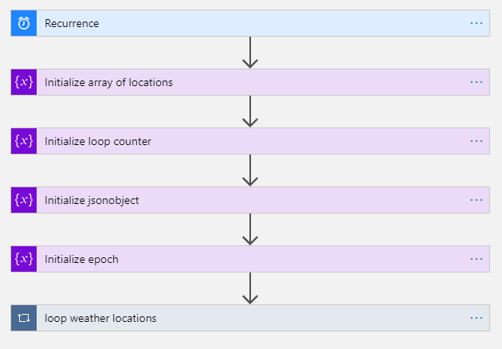
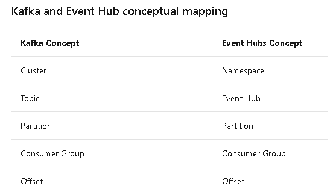
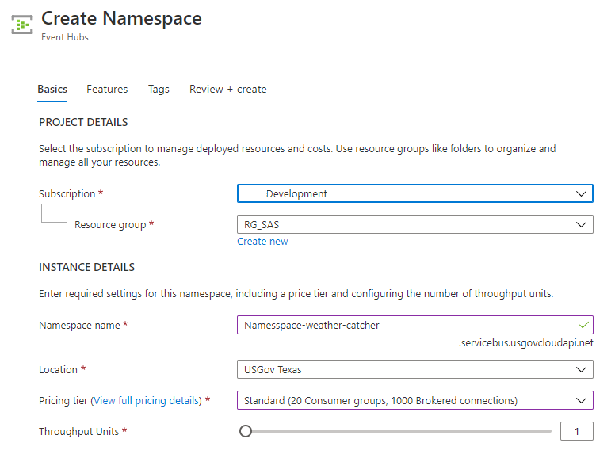
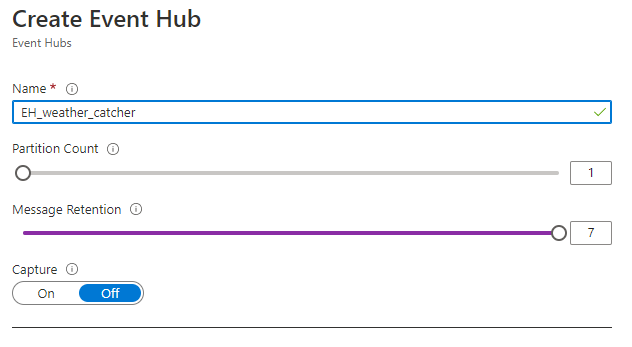
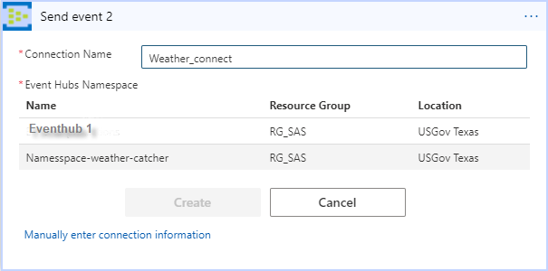
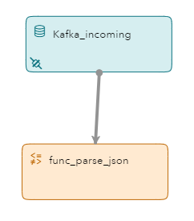
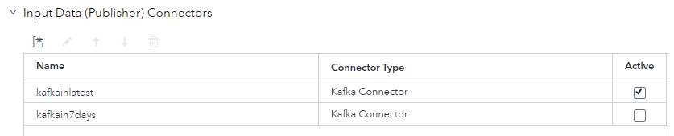
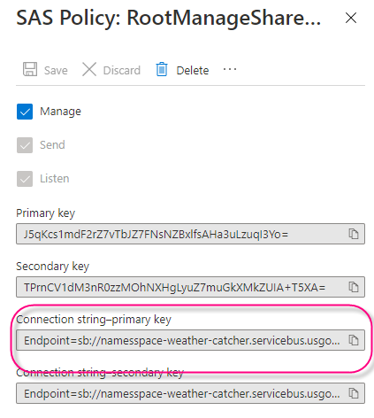

# ESP Azure Event Hub Integration

This repository contains code files supporting the SAS Community library artilce: [Streaming weather data into SAS Event Stream Processing from Azure](https://communities.sas.com/t5/SAS-Communities-Library/Streaming-weather-data-into-SAS-Event-Stream-Processing-from/ta-p/710250) by Tom Tuning.

In this repository you will learn how to stream data from an Azure event hub into a [SAS Event Stream Processing](https://www.sas.com/en_us/software/event-stream-processing.html) (ESP) model.

## Table of Contents

* [What You Will Learn](#what-you-will-learn)
* [Overview](#overview)
	* [Live Weather Data](#live-weather-data)
	* [Logic Application](#logic-application)
		* [Locations](#locations)
		* [Weather API key](#weather-api-key)
	* [Event Hub](#event-hub)
	* [Connecting the Logic App to the Event Hub](#connecting-the-logic-app-to-the-event-hub)
	* [ESP Project](#esp-project)
		* [Kafka Connector](#kafka-connector)
	* [JSON Decoding via ESP Function Window](#json-decoding-via-esp-function-window)
	* [Writing Messages to an Event Hub](#writing-messages-to-an-event-hub)
	* [Prerequisites](#prerequisites)
	* [Running](#running)
* [Contributing](#contributing)
* [License](#license)
* [Additional Resources](#additional-resources)

## What You Will Learn 

* How to use the ESP Kafka connector to connect to an event hub
* How to use a function window to transpose a JSON message into ESP events
* How to return write data back to the event hub
* How to drive messages into an Azure Event hub from a logic application


## Overview

In this project we will configure an Azure Logic application to query the Azure Maps Weather service once an hour.
The logic app will then format the data returned from the weather API into the required JSON string and send it to an Azure Event Hub.
Once in the Event Hub, it is available to any application running a Kafka listener.
An ESP project will be created which will retrieve these events from the Event Hub using an ESP Kafka connector.
Once in ESP a function window will be used to parse the incoming JSON into an ESP schema.


### Live Weather Data

For this example we will work with the [Azure Maps Weather service](https://docs.microsoft.com/en-us/azure/azure-maps/how-to-request-weather-data)
which will return a JSON message in response to an API call.
Please follow the directions described on the Azure Maps web page to request a subscription key which will be used to request weather data.
An example API call might be as follows:

```
https://atlas.microsoft.com/weather/currentConditions/json?api-version=1.0&query=47.60357,-122.32945&subscription-key={Azure-Maps-Primary-Subscription-key}
```

Which would generate a JSON response such as this: 

```
{
"results": [
    {
        "dateTime": "2020-10-19T20:39:00+00:00",
        "phrase": "Cloudy",
        "iconCode": 7,
        "hasPrecipitation": false,
        "isDayTime": true,
        "temperature": {
            "value": 12.4,
            "unit": "C",
            "unitType": 17
        },
        "realFeelTemperature": {
            "value": 13.7,
            "unit": "C",
            "unitType": 17
        },
        "realFeelTemperatureShade": {
            "value": 13.7,
            "unit": "C",
            "unitType": 17
        },
        "relativeHumidity": 87,
        "dewPoint": {
            "value": 10.3,
            "unit": "C",
            "unitType": 17    ...
```

### Logic Application

Consider the following Logic application flow: 



At a high level there are three parts to this flow.  First is a timer which triggers the flow once an hour.
Next variables are initialized.
Lastly, we loop through a list of locations and issue a weather API call for each.
Since Azure is a code first environment you can easily recreate this logic application in your Azure tenant by cloning the provided example.

[Logic App which retrieves weather forecasts](code/la_weather.json)

Once the logic app example is cloned into your tenant you will need to customize it to meet your location and API key.

####  Locations

Edit the location array and change these values to your latitude and longitude. 

```
{
    "name": "weather_locations",
    "type": "array",
    "value": [
        "35.79, -78.78",
        "35.78, -78.75"
    ]
}
```

#### Weather API key

Also edit the following key to match your subscription:
 
 ```
 "subscription-key": "ssRYdF8oylxr-B5_N0a7SUwOHlbGk6TsesTnV53Y"
 ```

### Event Hub

Next we need to configure an Event Hub to process events.
Azure uses the term Event Hub to mean both the cluster and the topic and it gets confusing so let's go over the conceptual mapping of terms between Kafka and Event Hub.



When you create a Kafka environment it is created by defining broker and zookeeper nodes to create a cluster.
Azure does not expose the zookeeper concept. Therefore, creating our Kafka cluster will simply consist of creating a namespace and an event hub.
This corresponds to creating a cluster and a topic in Kafka.
First create the namespace.



Next create the event hub or topic.



Max message retention is 7 days.  This means you will be able to replay 7 days' worth of messages from the event hub if needed.
Increasing the partition count will increase message throughput.  Since we are only producing 1 message per hour I will leave this at 1.

###  Connecting the Logic App to the Event Hub

Now that we have 2 Azure resources we need to connect them together so that messages flow between them.
Navigate back to the logic application created earlier and edit the Send event action.
Create a new connection using the namespace and event hub that was just created.



Now your LA is actively issuing calls to the weather API, parsing the responses into a JSON string and sending that information to the Event Hub.
Next we configure the ESP project to retrieve the messages from the Event Hub.


### ESP Project

Our ESP project will consist of 2 windows.
First will be a source window which will contain our Kafka connector.
Source windows provide a means for ESP to ingest data. 
Next will be a Function window which will parse the JSON string into the schema.



####  Kafka Connector

In this example I have set up 2 Kafka connectors.  The first will keep track of message offsets and retrieve only the latest message which has not been previously read.
The second will read all 7 days' worth of messages that are stored in the Kafka topic.
The difference is between needing current or historical data.



Let's take a closer look at the project XML to see how a connector is configured.

```
<connector class="kafka" name="kafkain7days" active="false">
      <description><![CDATA[Grabs 7 days' worth of data]]></description>
      <properties>
        <property name="type"><![CDATA[pub]]></property>
        <property name="kafkatype"><![CDATA[opaquestring]]></property>
        <property name="kafkainitialoffset"><![CDATA[smallest]]></property>
        <property name="urlhostport"><![CDATA[notusedwhennotHA]]></property>
        <property name="kafkahostport"><![CDATA[Namesspace-weather-catcher.servicebus.usgovcloudapi.net:9093]]></property>
        <property name="kafkatopic"><![CDATA[eh_weather_catcher]]></property>
        <property name="kafkapartition"><![CDATA[-1]]></property>
        <property name="kafkaglobalconfig"><![CDATA[security.protocol=SASL_SSL;sasl.username=$ConnectionString;sasl.password=Endpoint=sb://namesspace-weather-catcher.servicebus.usgovcloudapi.net/;SharedAccessKeyName=RootManageSharedAccessKey;SharedAccessKey=J5qKcs1mdF2rZ7vTbJZ7FNsNZBxlfsAHa3uLzuqI3Yo=;sasl.mechanism=PLAIN;ssl.ca.location=/etc/pki/tls/cert.pem]]></property>
      </properties>
</connector>
```

The namespace and event hub defined previously are mapped to their Kafka counterparts in the connector.

- **type** pub indicates messages are published to this ESP
- **opaquestring** indicates all message content is contained in one string variable
- **kafkainitialoffset** set to smallest will get every message available from this broker
- **urlhostport** is normally set to the zookeeper node which is unavailable in Azure
- **kafkahostport** refers to the Kafka broker URL
- **topic** and event hub are synonymous  
- **kafkapartition** = -1 means retrieve messages from any available partition
- **kafkaglobalconfig** defines the security and access used to talk to the broker
    

You must retrieve the sasl.password from the namespace defined in Azure.
First navigate to the namespace defined earlier and then click Shared access policies.
Copy the connection string-primary key into the ESP project.  For example:




### JSON Decoding via ESP Function Window

Since we parsed the weather data responses in the Azure Logic Application the JSON messages returned from the Event Hub contain only the information we require.
All we need to do now is parse the variables into the ESP schema.
The function windows is defined as follows: 

```
<window-functional pubsub="true" index="pi_EMPTY" name="func_parse_json">
  <description><![CDATA[Parse incoming json into fields.]]></description>
  <schema>
    <fields>
      <field name="index_esp" type="int64" key="true"/>
      <field name="deviceID" type="string"/>
      <field name="timestamp" type="stamp"/>
      <field name="Latitude" type="string"/>
      <field name="Longitude" type="string"/>
      <field name="humidity" type="int32"/>
      <field name="rain" type="double"/>
      <field name="rainplus1" type="double"/>
      <field name="temperature" type="double"/>
      <field name="windspeed" type="double"/>
    </fields>
  </schema>
  <function-context>
    <properties>
      <property-json name="jsonData"><![CDATA[$message]]></property-json>
    </properties>
    <functions>
      <function name="deviceID"><![CDATA[json(#jsonData,'deviceID')]]></function>
      <function name="timestamp"><![CDATA[json(#jsonData,'timestamp')]]></function>
      <function name="Latitude"><![CDATA[json(#jsonData,'Latitude')]]></function>
      <function name="Longitude"><![CDATA[json(#jsonData,'Longitude')]]></function>
      <function name="humidity"><![CDATA[json(#jsonData,'humidity')]]></function>
      <function name="location"><![CDATA[json(#jsonData,'location')]]></function>
      <function name="rain"><![CDATA[product(json(#jsonData,'rain'),.0393700787401575)]]></function>
      <function name="rainplus1"><![CDATA[product(json(#jsonData,'rainplus1'),.0393700787401575)]]></function>
      <function name="temperature"><![CDATA[json(#jsonData,'temperature')]]></function>
      <function name="windspeed"><![CDATA[json(#jsonData,'windspeed')]]></function>
    </functions>
  </function-context>
</window-functional>
```

### Writing Messages to an Event Hub

Now let's say we would like to return messages to an output topic called eh_weather_slinger from ESP.
To do that simply create another event hub or topic called eh_weather_slinger in the namespace called namesspace-weather-catcher as described above.
ESP connectors which publish data outbound are denoted with the type sub which is short for subscription.
We will also change the kafkatopic property to identify our newly created outbound topic or event hub.
Our connector description will be as follows:

```
<connector class="kafka" name="kafkaoutbound" active="false">
      <description><![CDATA[Publish data to outbound topic ]]></description>
      <properties>
        <property name="type"><![CDATA[sub]]></property>
        <property name="kafkatype"><![CDATA[opaquestring]]></property>
        <property name="kafkahostport"><![CDATA[Namesspace-weather-catcher.servicebus.usgovcloudapi.net:9093]]></property>
        <property name="kafkatopic"><![CDATA[eh_weather_slinger]]></property>
        <property name="kafkaglobalconfig"><![CDATA[security.protocol=SASL_SSL;sasl.username=$ConnectionString;sasl.password=Endpoint=sb://namesspace-weather-catcher.servicebus.usgovcloudapi.net/;SharedAccessKeyName=RootManageSharedAccessKey;SharedAccessKey=J5qKcs1mdF2rZ7vTbJZ7FNsNZBxlfsAHa3uLzuqI3Yo=;sasl.mechanism=PLAIN;ssl.ca.location=/etc/pki/tls/cert.pem]]></property>
      </properties>
</connector>
```

### Prerequisites

SAS Event Stream Processing

APPID from [Azure Maps Weather service](https://docs.microsoft.com/en-us/azure/azure-maps/how-to-request-weather-data)

Azure Account

### Running

**Note** There are examples of configuration files with matching models for you to use in the [code](/code) directory.

1.  Define your namespace and event hub in your Azure tenant.

2.  Logic Application  
    a.  Copy the logic app description from the code directory into your tenant.  
    b.  Update the subscription key.  
    b.  Test the API calls from the logic application are running correctly.  

3.  Edit the model xml file:  
    a.  Update the Kafka connection information to match your environment.
    
4.  Load and run the ESP XML model in an ESP server and view the results.

## Contributing

> We welcome your contributions! Please read [CONTRIBUTING.md](CONTRIBUTING.md) for details on how to submit contributions to this project. 

## License

> This project is licensed under the [Apache 2.0 License](LICENSE).

## Additional Resources

* [SAS Event Stream Processing 6.2 Product Documentation](https://go.documentation.sas.com/?cdcId=espcdc&cdcVersion=6.2&docsetId=espov&docsetTarget=home.htm&locale=en)
