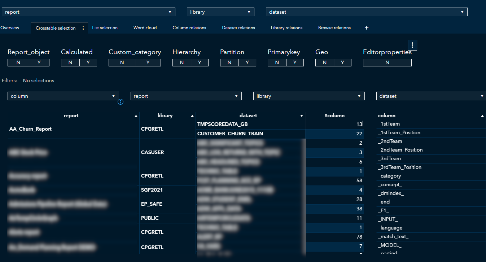
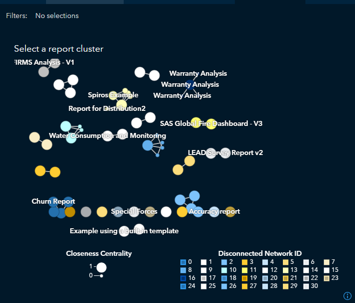

# va_lineage

A repository to collect all data used by SAS Viya Visual Analytics. The article [Discover Visual Analytics Report Paths with REST APIs](https://blogs.sas.com/content/sgf/2020/08/20/discover-visual-analytics-report-paths-with-rest-apis/) (Cindy Wang, 2020) explains well how to use the SAS Report REST API. The source columns used are only collected. The columns derived from source columns within Visual Analytics such as calculated items are not listed. However adding these columns would require little effort.

## Browsing through lineage

The result of running this code is the creation of 4 tables:
- VADATA
- VADATA_COLUMN_RELATIONS
- VADATA_DATASET_RELATIONS
- VADATA_LIBRARY_RELATIONS

The first of these can be used for browsing purpose. The other can be used the Visual Analytics object network analysis. Finally the report export is included in this repository for starters. 

## Browsing through lineage

## Display report relationships

